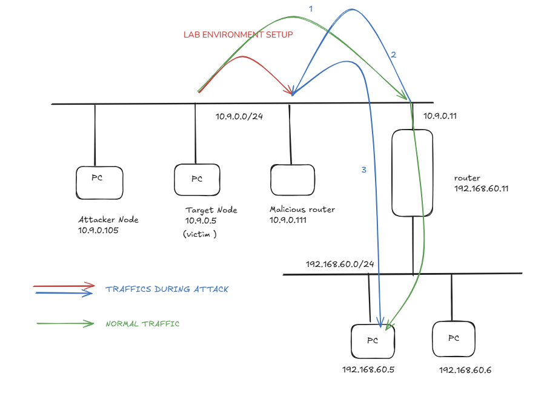

# Network Setup

## Topology



---

## IP Address Table

| Role             | IP Address                | Subnet            |
|------------------|---------------------------|-------------------|
| Attacker         | 10.9.0.105                | 10.9.0.0/24       |
| Victim           | 10.9.0.5                  | 10.9.0.0/24       |
| Malicious Router | 10.9.0.111                | 10.9.0.0/24       |
| Router           | 10.9.0.11 / 192.168.60.11 | Both subnets      |
| Target Host      | 192.168.60.5              | 192.168.60.0/24   |

---

## Network Structure

- **10.9.0.0/24** — Internal subnet shared by attacker, victim, malicious router, and one interface of the legitimate router.
- **192.168.60.0/24** — External subnet containing the target host and the router's second interface.
- The **legitimate router** (10.9.0.11 / 192.168.60.11) bridges both subnets and is the default gateway for the victim.

---

## Useful Diagnostic Commands

```bash
# Victim: view current routing table
ip route

# Victim: view routing cache (shows actively redirected routes)
ip route show cache

# Victim: flush routing cache to reset
ip route flush cache

# Victim: traceroute to confirm traffic path
mtr -n 192.168.60.5

# Malicious router: disable IP forwarding (required for MITM phase)
sysctl net.ipv4.ip_forward=0
```

---

## Netcat Test Setup

Used during Phase 2 to verify payload modification over TCP:

```bash
# On the target host — start a listener
nc -lp 9000

# On the victim — connect and send messages
nc 192.168.60.5 9000
```

Messages typed by the victim will be intercepted and modified by the malicious router before arriving at the target host.
